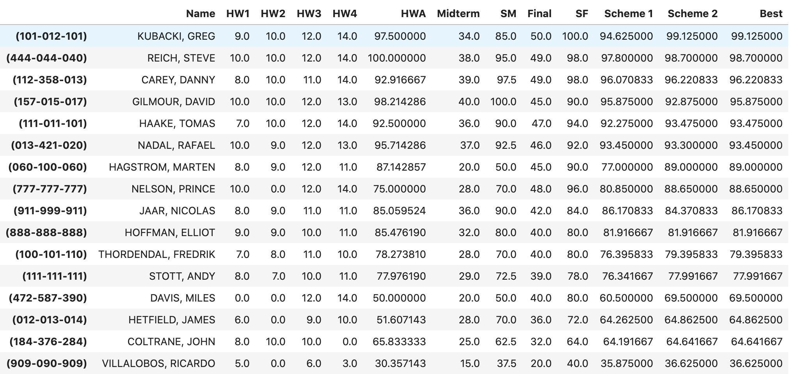
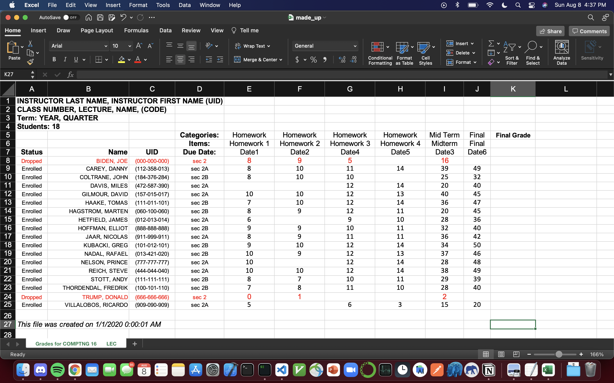

<!--
Content:

    1. Introduction
    2. Implementation Overview
    3. Usage

 -->

 <!-- PROJECT TITLE -->

# Final Grade Calculator

<!-- TABLE OF CONTENTS -->

  
Table of Contents

  <ol>
    <li><a href="#introduction">Introduction</a></li>
    <li><a href="#implementation-overview">Implementation Overview</a></li>
    <li><a href="#usage">Usage</a></li>
  </ol>

<!-- Introduction -->

## Introduction

At UCLA, classes can span anywhere from 50-300+ students. Professors along with TAs are constantly updating grades online and in order to calculate the final grades, there is some preprocessing that needs to take place to have a more consolidated and coherent record of student grades for any given class.

[MyUCLA](http://my.ucla.edu) is the portal site from which UCLA students, faculty, and staff can access information about a variety of UCLA's online resources and class information. MyUCLA gives professors a spreadsheet of all the students grades and additional information about course status, lecture details, class details, etc.

This Python script takes in the MyUCLA spreadsheet and returns a dataframe with additional information which orders students by their overall score. The script applies provided grading schemes and calculates the best scheme to apply to each student.

<!-- Implementation Overview  -->

## Implementation Overview

The script takes in an excel spreadsheet and preprocesses the file to include or relevant information in the table such as student UID, name, homework scores, and midterm/final grades. Utilzes Pandas to change column names, add homework average column and converts midterm and final grades to percentages.

Additionally, the script applies the two grading schemes passed in and takes the best of the 2 schemes and adds a 'Best' column to represent each students final grade.

<!-- USAGE EXAMPLES -->

## Usage

### Example of Spreadsheet passed as input to Script

### Example Output

